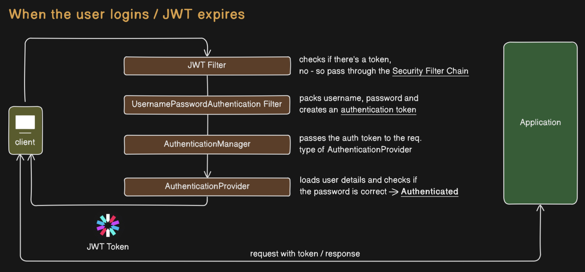
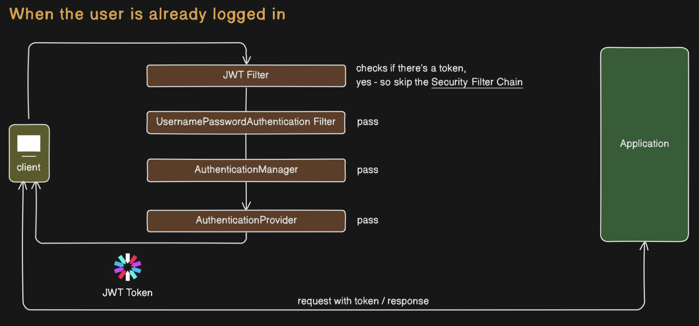

# JWT-based-auth-Springboot Private
> A Spring Boot project implementing JWT-based authentication.

## JWT Working
- User logs in with credentials.
- Server generates a JWT token.
- Client sends the token in Authorization header on requests.
- Server validates the token to authorize access.

## Architecture Diagrams

